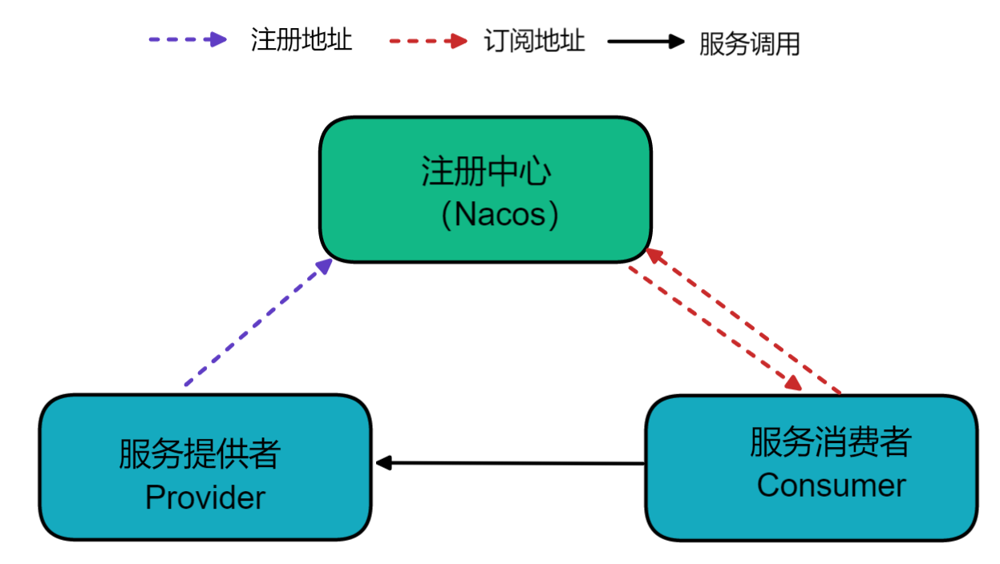
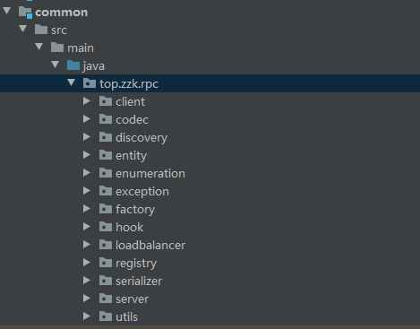

## zzk:rpc

The project is a tiny framework of RPC in the PRC learning process.

> 学习RPC过程中实现的简单RPC框架

### 当前实现特性
- 实现了两种通信方式：直接使用JDK socket和netty方式
- 实现了多种序列化方式：Json、Hessian、Kryo、Protostuff
- 支持注册中心/服务发现、序列化器、负载均衡策略可配置，非硬编码
- 实现注解进行服务自动注册

### 待添加特性：
- 支持配置文件进行服务自动注册
- 引入Spring，通过注解注册服务
- 设置gzip压缩
- 支持zookeeper做注册中心，最后能支持注册中心可配置
- 处理同一个接口可有多个类实现

### RPC架构示意图

和Dubbo是类似的，目前注册中心使用的是Nacos，采用硬编码方式，后续争取实现可配置，比如通过配置文件或者代码配置

### rpc模块
- `api`：存放服务接口的api
- `common`: rpc的核心实现， 里面有一些的目录结构如下,client是关于客户端的代码封装, server是关于服务端的代码封装， discovery是服务发现， entity、enumeratation、exception存放的是rpc的一些实体类和枚举类比如请求、响应、异常、错误码等, loadbalancer是负载均衡相关代码，registry是注册中心的代码封装，其他的是一些工具工厂方法
 

- `server`：存放服务端的代码示例
- `cilent`：存放客户端的代码示例